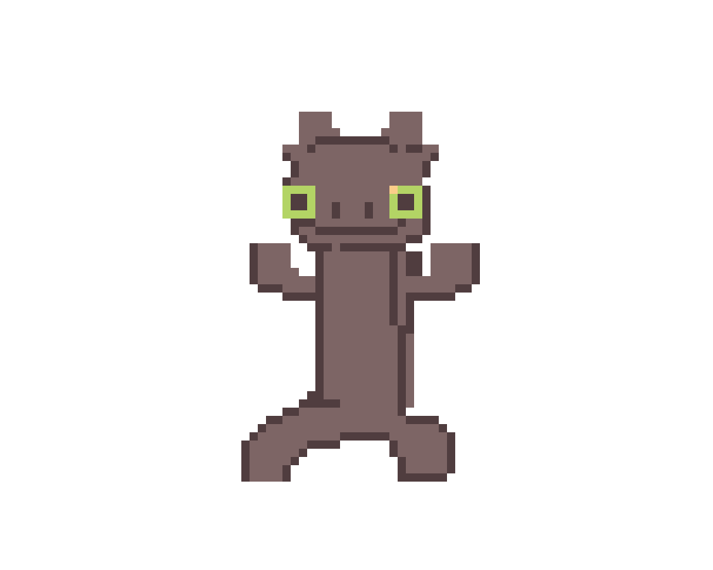
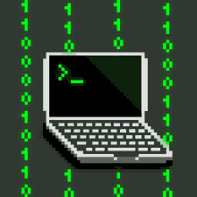
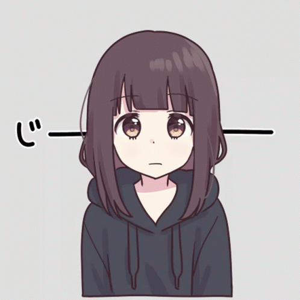
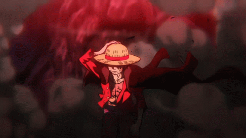
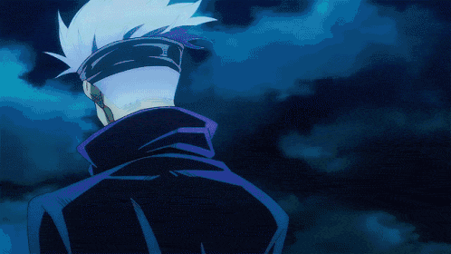
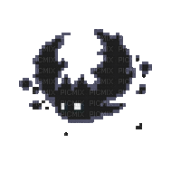
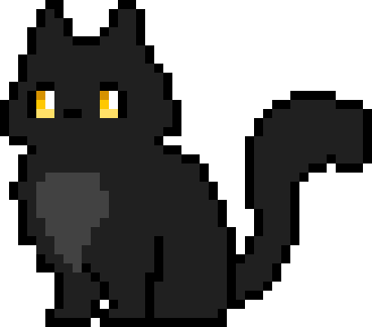
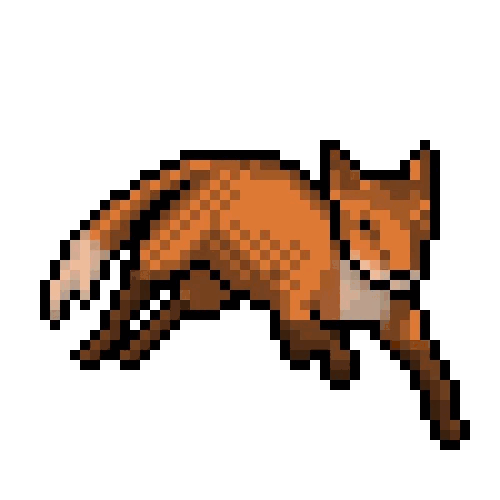
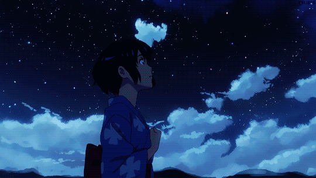

  

My life is a constant fight between who I am and who I want to become. Every day, I push through uncertainty, discipline my mind, and challenge my limits to grow stronger and wiser. I embrace the struggle because I know it’s shaping me into something greater. I don’t fear failure I use it. I don’t avoid difficulty I seek it. Because deep down, I know that everything I’m going through is building a version of me that refuses to settle.

###

###

  
  
  
  
  
  
  
  
  
  
  
  
  

###

  
                 

 ▄▄▄· ▄▄▄▄·       ▄• ▄▌▄▄▄▄▄    • ▌ ▄ ·. ▄▄▄ .
▐█ ▀█ ▐█ ▀█▪▪     █▪██▌•██      ·██ ▐███▪▀▄.▀·
▄█▀▀█ ▐█▀▀█▄ ▄█▀▄ █▌▐█▌ ▐█.▪    ▐█ ▌▐▌▐█·▐▀▀▪▄
▐█ ▪▐▌██▄▪▐█▐█▌.▐▌▐█▄█▌ ▐█▌·    ██ ██▌▐█▌▐█▄▄▌
 ▀  ▀ ·▀▀▀▀  ▀█▄▀▪ ▀▀▀  ▀▀▀     ▀▀  █▪▀▀▀ ▀▀▀   

  <b>🌟 Software Developer | 💻 Open Source Enthusiast | 🚀 Continuous Learner</b>

  
  
  
  

- 🌱 I’m currently learning: **HTML, CSS, and JavaScript**
- ⚙️ Passionate about **web development** and creating system logic
- 🧩 I enjoy breaking down complex systems and rebuilding them more efficiently
- 🚀 Currently building: **small tools, experiments, and system-level projects**
- 🤝 Open to collaborating on **open-source projects**
- 🧠 Fun fact: I debug code like a detective 🕵️‍♂️
- 🛠️ Tech I like: **C, C++, Rust, Linux**
- 🎯 Goal: Become a **systems engineer**

###

### 🛠 Skills

  

## 💻 Tech Stack

  

  
  
  
  
  
  

  
  
  
  

  
  
  
  
  

  
  
  
  

  

## 📊 GitHub Analytics

  

  

  
  

  

 

<picture>
    <source media="(prefers-color-scheme: dark)" srcset="https://contribution.oooo.so/_/KhornVictor?chart=3dbar&gap=2&scale=1.8&gradient=true&legend=true&legendPosition=bottomLeft&legendDirection=row&strokeWidth=2&strokeColor=003300&flatten=0&animation=wave&animation_duration=2&animation_delay=0.03&animation_amplitude=40&animation_frequency=0.2&animation_wave_center=0_6&weeks=36&theme=emerald_canopy&dark=true&format=svg">
    <source media="(prefers-color-scheme: light)" srcset="https://contribution.oooo.so/_/KhornVictor?chart=3dbar&gap=2&scale=1.8&gradient=true&legend=true&legendPosition=bottomLeft&legendDirection=row&strokeWidth=2&strokeColor=224422&flatten=0&animation=wave&animation_duration=2&animation_delay=0.03&animation_amplitude=40&animation_frequency=0.2&animation_wave_center=0_6&weeks=36&theme=native&format=svg">
    
</picture>

  
  
  
  

  

